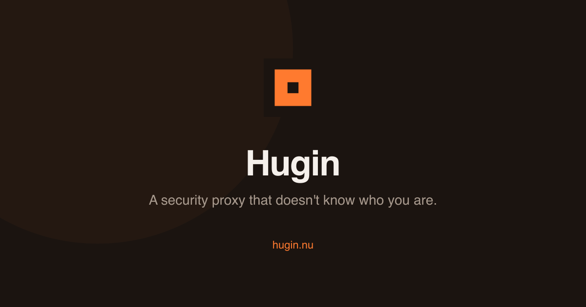

  

  <a href="https://hugin.nu">Website</a> &middot;
  <a href="https://hugin.nu/download">Download</a> &middot;
  <a href="https://hugin.nu/docs">Documentation</a> &middot;
  <a href="https://hugin.nu/pricing">Pricing</a>

---

## What is Hugin?

Hugin is a local-first security testing tool built in Rust. One binary, no accounts, no telemetry, no cloud. You see everything and send anything.

1.5 million lines of Rust across 37 crates. One binary. No JavaScript. No dependencies beyond the system WebView.

## Features

### Intercepting proxy

- HTTP/1.1, HTTP/2, HTTP/3 (QUIC), WebSocket, WebTransport — all in one proxy
- TLS fingerprint passthrough — no headless browser needed for most TLS-protected targets
- Browser automation via CDP and Marionette when you need full JS execution
- Site map, request/response inspection, live tampering, match-and-replace rules
- Cookie jar, session macros, WebSocket message interception

### Active scanner — 46 checks

Sends payloads and confirms real bugs. Not a pattern matcher.

| Category | Checks |
|----------|--------|
| Injection | SQLi, NoSQL, SSTI, command injection, LDAP, XPath, EL, email, SSJS, XML |
| XSS | Reflected, stored, DOM, prototype pollution (client + server) |
| Auth | JWT, OAuth, session fixation, Keycloak, mass assignment, BOLA, IDOR |
| Transport | HTTP request smuggling (CL.TE, TE.CL, H2 downgrade), H2-specific, WebSocket |
| Logic | Race conditions, CSRF, CORS, open redirect, path traversal, HPP, file upload |
| Advanced | GraphQL + authz, cache deception, cache poisoning, host header, XXE, deserialization |

### Passive scanner — 42 checks

Analyzes traffic without sending anything. Catches security headers, cleartext passwords, sensitive URLs, session tokens in URLs, ViewState issues, input reflection, Referer leaks, and more.

### AI agent — 162 MCP tools

Connect Claude, Cursor, or any MCP-compatible LLM. The agent can drive the proxy, run scanner checks, analyze flows, manage findings, and execute full testing workflows.

Tools cover: session management, flow capture and analysis, scanner control, finding triage, OOB interaction polling, vault operations, BAC matrix testing, fingerprinting, crawling, and more.

### Intruder

Fuzzer with payload generators, processors, grep matching, and rate control. Snipe positions, battering ram, pitchfork, cluster bomb.

### Repeater

Capture, modify, and replay any request. HTTP/1.1, HTTP/2, and HTTP/3 side by side.

### Race condition engine

Single-packet and last-byte sync techniques. Fire parallel requests to find TOCTOU bugs, rate-limit bypasses, and double-spend vulnerabilities.

### OOB interaction detection

Built-in OAST server. Capture blind interactions via DNS, HTTP, HTTPS, SMTP, LDAP, FTP, and SMB. No external collaborator needed.

### Crawler

Static and headless browser crawling. JS analysis, form submission, automatic scope expansion. Anti-fingerprinting built in.

### TLS fingerprint mirage

Mimic real browser TLS fingerprints (JA3/JA4). H2 fingerprint matching. Header order, font enumeration, navigator properties — all spoofable. Bypasses TLS-based WAF rules and bot detection.

### JS bundle engine

Capture, deminify, and analyze JavaScript bundles. Automatic source map extraction. DOM XSS sink analysis. Mine JS for endpoints, secrets, and dangerous patterns.

### Parameter discovery

Automatic parameter discovery from responses. Find hidden parameters, analyze pairs, detect injection points that manual testing misses.

### Content discovery

Built-in directory brute-forcing with wildcard calibration, sensitive-path heuristics, and export scrubbing. No separate tool needed.

### Mobile analysis

Android/iOS static analysis. APK decompilation, manifest analysis, storage inspection. Frida dynamic instrumentation. Network monitoring. All from the same binary.

### Decoder, Sequencer, Comparer

- **Decoder** — URL, Base64, HTML, hex, JWT, protobuf
- **Sequencer** — analyze token randomness and entropy
- **Comparer** — diff two responses visually and by bytes

### Lua extensions

Modify live traffic with scripts. 14 hook points: OnRequest, OnResponse, WebSocket, scanner, flow lifecycle, BAC, TLS. Permission-gated sandbox. No recompilation.

### Synaps WASM modules

Community scanner modules compiled to WASM. Sandboxed via Wasmtime with fuel limits and memory caps. Install with `hugin scanner install <name>`. Write your own with the guest SDK.

## Community (free, forever)

Everything above is free. No account required to start. No telemetry. No time limit.

## Pro — 7 EUR/month flat

- Race condition engine (single-packet, last-byte sync)
- Broken Access Control audit (IDOR, cross-tenant, JWT escalation, mass assignment)
- HTTP request smuggling (CL.TE, TE.CL, H2 downgrade, SmuggleHarvester)
- Synaps WASM modules (community scanner modules, sandboxed)
- Lua extensions (modify live traffic with scripts)
- Encrypted real-time collaboration
- Multi-project workspaces
- Full 162-tool MCP surface

No subscriptions. No auto-renewal. Pay when you need it.

## Students

GitHub Student Developer Pack holders get 12 months of Pro for free. No forms, no proof uploads — GitHub already verified you.

Claim at [hugin.nu/students](https://hugin.nu/students).

## Download

| Platform | Architecture |
|----------|-------------|
| macOS | Apple Silicon (aarch64), Intel (x86_64) |
| Linux | x86_64, aarch64 |
| Windows | x86_64 |

All binaries are Ed25519 signed. Verify at [hugin.nu/verify](https://hugin.nu/verify).

## Privacy

- No telemetry. No analytics. No crash reporting.
- Your traffic never leaves your machine.
- Accounts are anonymous IDs — no email, no password, no recovery.
- Payments via Stripe or Bitcoin/Monero (BTCPay). No KYC.

## This repository

This is the community hub for Hugin. The source code is not hosted here.

Use this repo to:

- **Report bugs** — [Open a bug report](../../issues/new?template=bug_report.yml)
- **Request features** — [Open a feature request](../../issues/new?template=feature_request.yml)
- **Discuss** — [Join discussions](../../discussions) for questions, ideas, and community chat
- **Track releases** — [Releases](../../releases) for changelogs and download links

## Links

- [hugin.nu](https://hugin.nu) — Website
- [hugin.nu/docs](https://hugin.nu/docs) — Documentation
- [hugin.nu/about](https://hugin.nu/about) — Why Hugin exists
- [X / Twitter](https://x.com/HuginCyber) — @HuginCyber
- [LinkedIn](https://www.linkedin.com/company/hugin-cyber) — Hugin Cyber

## License

Hugin is proprietary software. The Community tier is free to use. See [hugin.nu/pricing](https://hugin.nu/pricing) for details.
